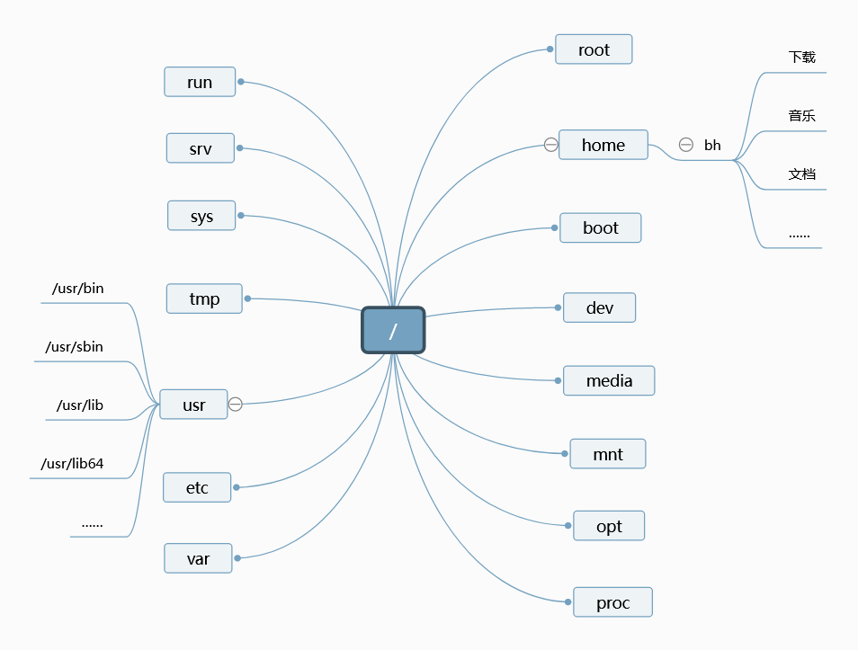

# Linux 文件系统

## 了解 Linux 文件系统

Linux 系统中所有东西（数据、命令、符号连结、设备和文件夹）都是以文件夹或文件的形式储存在文件系统中，而整个文件系统就像一棵树一样。所有的主要文件夹都存储在根目录（`/`）的下方，所有的文件都分散在各个文件夹中。

与 Windows 不同的一点，Linux 的不同层级的文件夹之间都是使用斜杠 `/` 进行区分，而不是 NTFS 文件系统常用的反斜杠，比如 `C:\Program Files (x86)\Microsoft`。这也是为什么当今所有的网页地址都是使用斜杠而非反斜杠的原因之一。且 Linux 中所有的绝对路径都是以 `/` 开头。

同时，Linux 文件名是有分区大小写的。例如 Apple.c、APPLE.c、apple.C 和 ApplE.c 是四个不同的文件。



如果你要确认某个文件或文件夹的位置，比如 `Applications` 文件夹中用户自己创建的 `Mount.sh`。你可以从 `/` 开始，将它的位置表示为 `/home/bh/Applications/Mount.sh`，这种表示形式称之为**绝对路径**，除此之外的表达都是**相对路径**。例如，从 `/home` 开始，该文件可以表示成 `~/Applications/Mount.sh`，如果你现在就在 `~` 文件夹中，你可以将它表示为 `Applications/Mount.sh`。

对于 `/` 目录之下的文件的常见用途，如下所示：

|名称|用途|
|---|---|
|/bin|包含普通的 Linux 用户命令，如 `ls`、`date` 等|
|/boot|具有可引导的 Linux 内核、初始 RAM 磁盘和引导加载程序配置文件 (GRUB)。|
|/dev|包含代表系统上设备访问点的文件。这些包括终端设备（tty*）、硬盘（hd* 或 sd*）、RAM（ram*）和 CD-ROM（cd*）。用户可以通过这些设备文件直接访问这些设备； 但是，应用程序通常会向最终用户隐藏实际的设备名称|
|/etc|包含管理配置文件。 这些文件中的大多数都是纯文本文件，只要用户有适当的权限，就可以使用任何文本编辑器对其进行编辑。|
|/home|包含分配给每个具有登录帐户的普通用户的目录。（root 用户是一个例外，使用 /root 作为他的主目录。|
|/media|为自动安装设备（尤其是可移动媒体）提供标准位置。 如果介质具有卷名，则该名称通常用作安装点。例如，卷名为 myusb 的 USB 驱动器将挂载到 `/media/myusb`。|
|/lib|包含 `/bin` 和 `/sbin` 中的应用程序启动系统所需的共享库|
|/mnt|在被标准 `/media` 目录取代之前，它是许多设备的通用挂载点。一些可引导的 Linux 系统仍然使用这个目录来挂载硬盘分区和远程文件系统。许多人仍然使用这个目录来临时挂载本地或远程文件系统，这些文件系统不是永久挂载的。|
|/misc|有时用于根据请求自动挂载文件系统的目录。|
|/opt|可用于存储附加应用软件的目录结构。|
|/proc|包含有关系统资源的信息。|
|/root|root 用户的主目录|
|/sbin|包含管理命令和守护进程。|
|/sys|包含调整块存储和管理 cgroup 等参数。|
|/temp|包含应用程序使用的临时文件。|
|/usr|包含用户文档、游戏、图形文件 (X11)、库 (lib) 以及引导过程中不需要的各种其他命令和文件。/usr 目录用于存放安装后不会更改的文件（理论上，/usr 可以只读方式挂载）</p>有关社区对于文件目录的调整（[Usr Merge](https://wiki.debian.org/UsrMerge)），详见[此处](https://www.suse.org.cn/%E6%8A%80%E6%9C%AF%E6%96%87%E7%AB%A0/2021/04/28/%E9%87%87%E5%8F%96-UsrMerge-%E6%8E%AA%E6%96%BD%E7%9A%84%E7%90%86%E7%94%B1.html)。|
|/var|包含各种应用程序使用的数据目录。特别地，你可以在此处放置作为 FTP 服务器 (`/var/ftp`) 或 Web 服务器 (`/var/www`) 共享的文件。它还包含所有系统日志文件 (`/var/log`) 和 `/var/spool` 中的假脱机文件（例如 mail、cups 和 news）。`/var` 目录包含经常更改的目录和文件。在服务器上，通常使用可以轻松扩展的文件系统类型将 `/var` 目录创建为单独的文件系统。|

在 Linux 中，文件并不需要像 windows 那样的后缀名（.txt、.xls）。后缀名也没有实际意义，后缀名并不影响文件的功能，但它有助于帮助用户理解此文件的用途。此外，Linux 文件系统有着严格且明确的权限和所有权管理系统，这将在后文详述。

## 使用基本的文件系统命令

要在命令行中与文件系统进行交互，你至少需要知道以下命令。

|命令|功能|
|---|---|
|cd|变更到另一个文件夹|
|pwd|将你当前所在的文件夹打印到屏幕上|
|mkdir|创建一个文件夹|
|chmod|更改一个文件夹或文件的权限|
|ls|列出指定目录的文件夹和文件|
|touch|用于创建纯文本文件|

一般地，当你打开一个终端后，你所在的文件夹是你的用户文件夹（`~`）。你可以使用 `cd` 命令移动到指定的目录（路径可以是绝对路径或相对路径），如：

```
[bh@c004-v1 ~]$ ls #列出当前目录的文件
公共  模板  视频  图片  文档  下载  音乐  桌面  Applications  FolderA
[bh@c004-v1 ~]$ cd Applications #移动到 Applications 子文件
[bh@c004-v1 Applications]$ ls #列出当前目录的文件
CFW  Icalingua-2.4.5.AppImage  mount.sh
[bh@c004-v1 Applications]$ pwd #打印当前目录至输出
/home/bh/Applications
[bh@c004-v1 Applications]$ cd /usr/share/backgrounds #移动到 /usr/share/backgrounds
[bh@c004-v1 backgrounds]$ ls #列出当前目录的文件
default.png  default.xml  f35  images  wallhaven-967zyk.jpg  xfce
[bh@c004-v1 backgrounds]$ pwd #打印当前目录至输出
/usr/share/backgrounds
[bh@c004-v1 backgrounds]$ cd ~ #回到用户主目录
[bh@c004-v1 ~]$ pwd #打印当前目录至输出
/home/bh
```

直接输入 `cd` 也可以立即回到用户主目录；你可以使用 `..` 表示上一级文件夹（相对路径），`.` 表示当前文件夹，如：

```
[bh@c004-v1 Applications]$ ls -lat
总用量 111440
drwx------. 1 bh bh       440  1月 18 16:22 ..
-rwxrw-rw-. 1 bh bh       117  1月 12 11:35 mount.sh
drwxr-xr-x. 1 bh bh        70  1月  8 14:54 .
drwxr-xr-x. 1 bh bh       620  1月  8 13:47 CFW
-rwxrwxrwx. 1 bh bh 114110270 12月 23 15:01 Icalingua-2.4.5.AppImage
[bh@c004-v1 Applications]$ cd ..
[bh@c004-v1 ~]$ pwd
/home/bh

[bh@c004-v1 Applications]$ cd ./CFW
[bh@c004-v1 CFW]$ pwd
/home/bh/Applications/CFW
```

`mkdir` 用于创建文件夹，要在用户目录内新建一个名为 test 文件夹，只需要：

```
$ mkdir test #或者 mkdir ~/test
```

## 使用元字符和运算符

你可以使用元字符匹配一个或多个文件而无需输入完整的文件名。运算符可以帮助你将一个命令或文件的信息重定向至另一个文件或命令。

### 使用元字符匹配文件

|元字符|用途|
|---|---|
|*|匹配任意数量的字母|
|?|匹配任意一个字母|
|[...]|匹配括号之间的任何一个字符，可以包括连字符分隔的字母或数字范围|

例如，首先在 `~` 下创建一个文件夹 A1，然后移动至该文件夹，并使用 `touch` 创建一系列的纯文本文件：

```
[bh@c004-v1 A1]$ ls
apple  banana  grape  grapefruit  watermelon
[bh@c004-v1 A1]$ ls a*
apple
[bh@c004-v1 A1]$ ls g*t
grapefruit
[bh@c004-v1 A1]$ ls *e*
apple  grape  grapefruit  watermelon
```

第二个命令会匹配以 a 开头的文件；第二个命令会匹配以 g 开头，t 结尾的文件，第二个命令会陪陪含有 e 字母的文件。

```
[bh@c004-v1 A1]$ ls ????e
apple  grape
[bh@c004-v1 A1]$ ls g???e*
grape  grapefruit
```

第一个命令会匹配以 e 结尾，含有五个字母的文件；第二个则会匹配以 g 开头，以 e 作为第五个字母的文件。

```
[bh@c004-v1 A1]$ ls [abw]*
apple  banana  watermelon
[bh@c004-v1 A1]$ ls [agw]*[ne]
apple  grape  watermelon
[bh@c004-v1 A1]$ ls [a-g]*
apple  banana  grape  grapefruit
```

第一个命令会匹配以括号内 a、b 或 w 开头的文件；第二个命令则会匹配以 a、g 或 w 开头，以 n 或 e 结尾的文件；第三个命令则会匹配以括号内 a 至 g 之间 7 个字母开头的文件。

### 使用元字符对文件重定向

|元字符|用途|
|---|---|
|<|将文件的内容定向到命令。在大多数情况下，这是命令所期望的默认操作，字符的使用是可选的；使用 `less bigfile` 与 `less < bigfile` 相同|
|>|将命令的标准输出定向到文件。如果文件存在，则覆盖该文件的内容。|
|2>|将标准错误（错误消息）定向到文件。|
|&>|将标准输出和标准错误都指向文件。|
|>>|将命令的输出定向到文件，并将输出添加到现有文件内容的末尾。|

- Linux 不仅所有东西都可以用文件夹或者文件表示，同时大量软件的配置文件、日志文件和错误日志都是纯文本。

```
bh@localhost:~> echo "现在的时间是$(date)。" >> ~/Test
bh@localhost:~> cat Test
今天的天气非常好！
现在的时间是2022年 01月 19日 星期三 13:26:07 CST。
```

如上，使用 `echo` 将 “现在的时间是 $(date)。” 打印到终端，然后使用 `>>` 将输出结果导入到 `~/Test` 文本文件的末尾（如果文件不存在，那命令会自动创建一个文件）。

### 使用花括号扩展字符

通过使用花括号 (`{}`)，您可以在文件名、目录名或您提供命令的其他参数之间展开一组字符。例如，如果你想创建一组文件，例如 memo1 到 memo5，你可以这样做：

```
bh@localhost:~> mkdir TEST; cd TEST; touch sample{A,B,C,D}*{1,2,3,4}
bh@localhost:~/TEST> ls
sampleA*1  sampleA*3  sampleB*1  sampleB*3  sampleC*1  sampleC*3  sampleD*1  sampleD*3
sampleA*2  sampleA*4  sampleB*2  sampleB*4  sampleC*2  sampleC*4  sampleD*2  sampleD*4
```

如上，使用花括号可以创建一系列依照规定字符的文件。花括号也可以用于其他命令，比如查找具有特定特征的文件。要删除这些新建文件，可运行 `$ rm sample*`。

## 列出文件和路径

你可以使用 `ls` 命令列举出当前所在目录的文件夹，如

```
bh@localhost:~> ls -lat 
总用量 48
drwx------ 1 bh   bh    390  1月 19 13:39 .
-rw-r--r-- 1 bh   bh      0  1月 19 13:39 test
-rw------- 1 bh   bh     20  1月 19 13:18 .lesshst
drwx------ 1 bh   bh    528  1月 19 13:17 .cache
drwx------ 1 bh   bh   1482  1月 19 13:17 .config
-rw-r--r-- 1 bh   bh    268  1月 19 13:17 .gtkrc-2.0
-rw------- 1 bh   bh   1401  1月 19 11:21 .bash_history
drwxr-xr-x 1 bh   bh    156  1月 19 11:19 图片
drwxr-xr-x 1 bh   bh      0  1月 15 21:23 下载
-rwxrwxrwx 1 bh   bh    117  1月 11 16:16 mount.sh
... ...
```

第一列中类似 `drwx------` 这样一串的字符则表示了该项的属性。这一串字符由10个字符组成，第一个字符表示该项的属性，`d` 表示这是一个文件夹，`-` 表示这是一个文件，`l` 表示这个是一个符号链接。除此之外，你还可能会看到 `b`（表示块设备）、`c`（表示字符设备）、`s`（表示套接字）和 `p`（表示命名管道）。

后九位表示该文件或文件夹的读取（read，`r`）、写入（write，`w`）、运行（execute，`x`）权限。如果没有权限，则相应的位置上会被 `-` 代替。例如文件所有者没有执行权限，则该串字符的前三个字符应该是 `rw-`。

如果你是在终端应用程序中使用该命令，则文件、文件夹和符号链接会具有不同的颜色，其他的文件也可能会有不同于前三者的颜色以示区别。这是因为你在终端中使用的 `ls` 默认带有一个 `--color=auto` 的选项。

第二列是连接到该文件夹或文件的硬连接数量，第三和第四列是该文件或文件夹所有者的用户名与主要的用户组名。第五列是文件或文件夹大小（以比特为单位，它并不能显示文件的准确大小，建议你还是直接打开文件管理器看看实际准确大小），第六列是最近一次修改文件夹或文件的时间和日期（时间和日期的显示方式会因为语言的不同而不同）。

文件名和目录名显示在最后一列中。此外，`.` 表示当前文件夹，`..` 表示上一层的文件夹。以 `.` 开头的东西是隐藏的文件或文件夹。

更多有关 `ls` 的内容，请翻阅 `$ man ls`。

## 理解文件权限和所有权

`ls -lat` 中显示的那一串 10 位字符的后九位定义了该文件或文件夹的权限，决定了用户对于该文件是否具有读写执行的权限。这九个字符的前三个定义了文件所有者的权限，中间三个字符定义了文件所属的用户组的权限，最后三个字符定了其他用户的权限。

以下是三种权限的用途：

|权限名|文件|文件夹|
|---|---|---|
|Read（读取）|浏览该文件的内容|浏览该文件夹和其子文件夹|
|Write（写入）|更改文件的内容、名称或删除该文件|向该文件夹添加子文件夹或文件，或删除文件和子文件夹|
|Execute（执行）|将该文件作为程序运行|将目录更改为当前目录，搜索目录，或从目录执行程序。访问该目录中文件的文件元数据（文件大小、时间戳等）|

要查看特定文件夹或文件的权限，你可以使用 `ls -ld`，如：

```
bh@localhost:~> ls -ld Applications test
drwxr-xr-x 1 bh bh 194  1月 15 20:53 Applications
-rw-r--r-- 1 bh bh   0  1月 19 14:31 test

```

如上，Applications 文件夹归属于 `bh` 用户组，所有者是 `bh` 并具备完整的读写与执行权限；`bh` 用户组的用户只能读取或执行该文件夹，其他用户也只能读取和执行该文件夹。文件 test 归属于 `bh` 用户组，所有者是 `bh`，但只具有读写权限（这表示文件所有者不能将该文件作为程序运行）；`bh` 用户组的用户和其他用户均只能读取该文件，没有其他权限。

### 更改文件权限

你可以使用 `chmod` 修改文件夹或文件的所有者、所属组和其他用户权限。`chmod` 有两个操作方式，一种是使用数字表示权限，一种是使用字母表示权限。如下：

```
bh@localhost:~> ls -ld test
-rw-r--r-- 1 bh bh 0  1月 19 14:31 test
bh@localhost:~> chmod 666 test
bh@localhost:~> ls -ld test
-rw-rw-rw- 1 bh bh 0  1月 19 14:31 test
```

如上，`666` 表示的权限就是 `rw-rw-rw-`，使用 `-R` 选项可以将这个命令的效果应用到整个文件夹及其子文件夹中，例如：`$ chmod -R 666 ~/下载`。具体的权限组合请查阅下表：

|字符|数字|权限|
|---|---|---|
|`---`|0|无权限|
|`--x`|1|只执行|
|`-w-`|2|只写|
|`r--`|4|只读|
|`r-x`|5|只读，只执行|
|`rw-`|6|只读写|
|`rwx`|7|完整权限|

第二种方式是使用字母，它的好处就是没有好处，因为人会健忘。要么你选择背权限数值，要么你得多记几个选项。(¬‿¬)

第二种方法中，添加权限是 `+`，删除权限是 `-`。所有者是 user（`u`），用户组是 group（`g`），其他用户是 others（`o`），所有人则是 all（`a`）。

然后就是“编辑对象 + 操作 + 权限”的组合结构。比如，`a-w` 的含义就是撤销所有人对于该文件或文件夹的写入权限。`go+x` 的含义就是赋予文件或文件夹所属的用户组和其他用户该文件夹的执行权限。

```
bh@localhost:~> touch test; ls -ld test
-rw-r--r-- 1 bh bh 0  1月 19 15:09 test
bh@localhost:~> chmod go+x test
bh@localhost:~> ls -ld test
-rw-r-xr-x 1 bh bh 0  1月 19 15:09 test
```

如上，新建一个 `rw-r--r--` 的文件 test，然后赋予文件或文件夹所属的用户组和其他用户该文件夹的执行权限。此处的 test 是一个参数（相对路径），你也可以将其替换成绝对路径。

- 注意，请不要随意更改你的用户文件夹（`~`）以外的任意文件夹的权限，除非你知道你在干什么，否则别瞎搞。

### 使用 umask 设置文件的默认权限

当你创建一个文件夹或文件的时候，这个文件夹所具有的初始权限由 `umask` 的值定义。打开终端，输入 `$ umask` 你就能看到一串四位数。忽略掉第一个 0。剩下的数就是你的默认文件权限的相反数。例如：

```
bh@localhost:~> umask
0022
bh@localhost:~> mkdir A1; ls -ld A1
drwxr-xr-x 1 bh bh 0  1月 19 15:26 A1
```

此处显示的 umask 值是 022，一个所有人都具有完整权限的文件夹的权限值是 777。777 - 022 = 755，此时新建文件夹的权限就是 `rwxr-xr-x`。

你可以使用 `$ umask <数字><数字><数字><数字>` 的形式临时修改 umask 值，然后新建的文件夹都会遵循这个值的限制。要永久修改 umask 值，你需要将此命令写入到 `.bashrc` 文件中。

### 更改文件所有权

你可以使用 `chown` 修改一个文件的所有者，所属的用户组。先确定用户名和用户组，然后指定文件或文件夹所在位置（可以使用相对路径，但请确保路径是正确的），如下：

```
bh@localhost:~> ls -ld test
-rw-r--r-- 1 bh bh 0  1月 19 15:31 test
bh@localhost:~> sudo chown root:root /home/bh/test
[sudo] root 的密码：
bh@localhost:~> ls -ld test
-rw-r--r-- 1 root root 0  1月 19 15:31 test
```

类似地，你还可以使用 `-R` 选项将这个更改应用到此文件夹的子文件和子文件。


## 移动、复制和删除文件

|命令|含义|
|---|---|
|mv|移动文件至指定位置|
|cp|复制文件至指定位置|
|rm|删除文件|
|cat|读取文本文件|

`mv` + 要移动的文件的路径 + 目的地的路径

`cp` + 要移动的文件的路径 + 目的地的路径

`rm -r` + 要删除的文件夹的路径

`cat` + 要读取的文本文件路径

更多信息请使用 `man` 阅读用户手册，例如 `man cp`