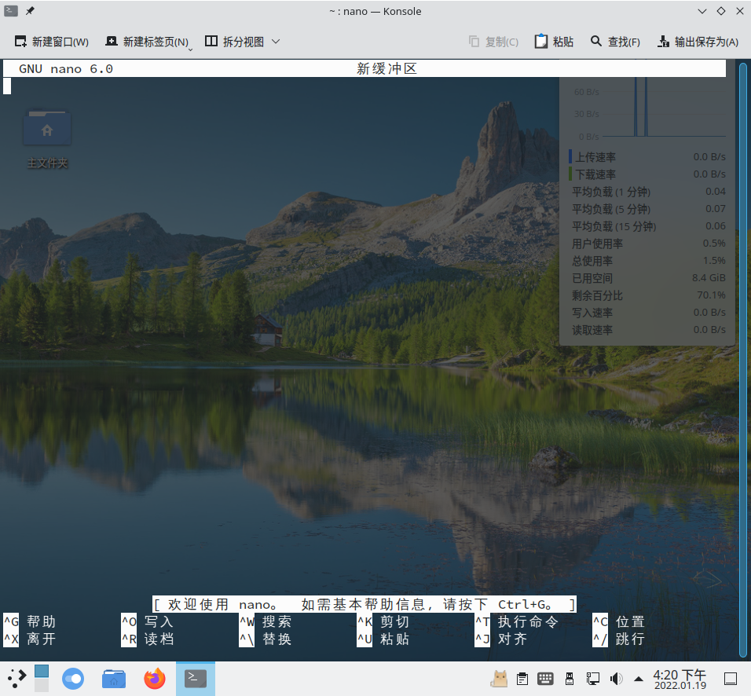

# 运用文本文件

与 Windows 不同，你可以通过编辑储存于特定目录（比如 `/etc`）的纯文本文件来实现对于系统配置的修改和管理系统。

## 使用文本编辑器编辑文件

Linux 终端常用的文本编辑器有很多，其中比较知名的有 [Vim](https://www.vim.org)、[Emacs](https://www.gnu.org/software/emacs/) 和 [Nano](https://www.nano-editor.org/)

流行的图形化的文本编辑器还有：[KDE Kate](https://apps.kde.org/kate/)、[Gnome Gedit](https://wiki.gnome.org/Apps/Gedit)、[Xfce Mousepad](https://docs.xfce.org/apps/mousepad/start) 和微软的 [Visual Studio Code](https://code.visualstudio.com/)。前三者分别是各个主流桌面环境内置的默认文本编辑器，VScode 则是近年来由微软开发，广受开发人员好评的一个富文本编辑器。

如果你想要深入了解如何在命令行界面中工作，Emacs 和 Vim 是两个功能强大，扩展丰富，值得信赖的专业工具集。

如果你只是偶尔用用命令行界面，你可以简单学习以下如何使用 Nano 编辑文件。

### 使用 Nano

Nano 一般已经安装到你的 Linux 中，打开终端，输入 `$ nano`



如上图所示，Nano 是一个功能简单，界面友好的轻量级编辑器。底部有快捷键提示。要查询更多信息，按下 `Ctrl + G` 即可打开用户手册，按 `q` 即可退出手册页。

你可以使用方向键控制光标的位置，同时使用鼠标进行辅助（如选中内容，上下翻页）。快捷键组合中的 `^` 是指 `Ctrl` 键。编辑完文件后，注意保存（Ctrl + O）然后再退出编辑器（Ctrl + X）。

你可以使用 nano 编辑指定路径的文件，如 `$ nano ~/.bashrc`，如果你编写的文件并不存在，Nano 会在你保存后创建该文件。

## 搜索文件

### 使用 locate 按文件名搜索文件

一般而言，Linux 有一个名为 `updatedb` 的后台进程每日都会运行一次，将整个系统的所有文件的文件名导入到一个数据库中。你可以使用 `locate` 命令检索这个数据库。

有关于 `locate` 命令需要知道的几件事：

- `locate` 命令和 `find` 命令相比，各有优劣。`locate` 搜索速度更快是因为它只要检索一个数据库而不是整个文件系统。因此，`locate` 受限于数据库刷新的滞后性，在数据库更新前无法检索到新添加的文件。 
- 数据库不会记录所有的文件。`/etc/updatedb.conf` 文件的内容通过删除选择的挂载类型、文件系统类型、文件类型和挂载点来限制收集某些文件名。例如，数据库不会收集挂载的远程文件系统（如 NFS）。用于存储临时文件的目录（`/tmp`）和假脱机文件（`/var/spool/cups`）也被排除在外。<br />
    你可以编辑 `/etc/updatedb.conf`，将不需要被记录的内容添加到 `PRUNEPATHS` 或 `PRUNENAMES` 中。或者删除某些内容来启用记录。
    ```
    [bh@c004-v1 ~]$ cat /etc/updatedb.conf
    PRUNE_BIND_MOUNTS = "yes"
    PRUNEFS = "9p afs anon_inodefs auto autofs bdev binfmt_misc cgroup cifs coda configfs cpuset debugfs devpts ecryptfs exofs fuse fuse.sshfs fusectl gfs gfs2 gpfs hugetlbfs inotifyfs iso9660 jffs2 lustre mqueue ncpfs nfs nfs4 nfsd pipefs proc ramfs rootfs rpc_pipefs securityfs selinuxfs sfs sockfs sysfs tmpfs ubifs udf usbfs ceph fuse.ceph"
    PRUNENAMES = ".git .hg .svn .bzr .arch-ids {arch} CVS"
    PRUNEPATHS = "/afs /media /mnt /net /sfs /tmp /udev /var/cache/ccache /var/lib/yum/yumdb /var/lib/dnf/yumdb /var/spool/cups /var/spool/squid /var/tmp /var/lib/ceph /var/lib/mock /sysroot/ostree/deploy"
    ```

作为一个普通用户，你同样无法使用 `locate` 检索你无权访问的文件（比如 `/root` 中的文件）。

- 当你搜索一串字符串的时候，这串字符可能会出现在路径、文件名或目录名中（比如搜索 `passwd`，结果就包含了 `/etc/passwd`、`/etc/pam.d/passwd` 等）。
- 要手动更新数据库，只需要以 root 权限重新运行一遍 `# updatedb` 即可。
- 要查询文件系统中匹配字符串的所有文件或路径，你需要使用 root 权限。

### 使用 find 搜索文件

`find` 也是一个常用的用于检索文件的工具。找到文件后，你也可以通过运行任何你想要的命令来处理这些文件（使用 `-exec` 或 `-okay` 选项）。

由于 `find` 不依赖数据库而实时检索指定的文件夹（并不建议使用 `find` 搜索整个文件系统），所以 `find` 一般比 `locate` 花费更长的时间但能更精准地发现文件。

`find` 的另一个特色功能就是，你可以将几乎所有的文件属性（文件名、目录名、路径、权限、所有权、大小或最后编辑时间等）当作命令选项来搜索文件。

```
$ find
$ find /etc
# find $HOME -ls
```

如上，直接使用 `find` 命令，`find` 会直接列出当前文件夹的全部文件和目录。如果你需要搜索特定的目录，只需要将此目录作为选项加到 `find` 命令的后面（如第二个命令，你一般会遇到报错信息，如果你要搜索 `~` 以外的目录，有时候需要使用 root 权限来访问某些权限受限文件夹。）。第三个样例使用了 `-ls` 的选项（它的效果类似于 `$ ls -l`）。

#### 通过名称查找文件

要使用名称来查找文件，你需要使用 `-name` 和 `-iname` 选项。命令只搜索文件的基本名称，默认不会搜索目录的名称。为了使搜索更加灵活，你还可以使用元字符（如 * 和 ? 等字符）来帮助你进行模糊搜索。如下：

```
[bh@c004-v1 ~]$ sudo find /etc -name passwd
/etc/pam.d/passwd
/etc/passwd
[bh@c004-v1 ~]$ sudo find /etc -iname '*passwd*'
/etc/pam.d/passwd
/etc/security/opasswd
/etc/passwd-
/etc/passwdqc.conf
/etc/passwd
```

如上，第一个使用 `-name` 选项，不带星号的命令会精准匹配 `/etc` 目录下所有名为 `passwd` 的文件。第二个使用 `-iname` 选项，带有星号的命令会匹配所有带有 `passwd` 字符串（不区分大小写）的文件。

- 注意，`find` 命令默认的起始搜索位置是你的工作目录（`$PWD`）。要搜索其他目录，你需要为 `find` 设置一个路径参数。

#### 提供大小查找文件

使用