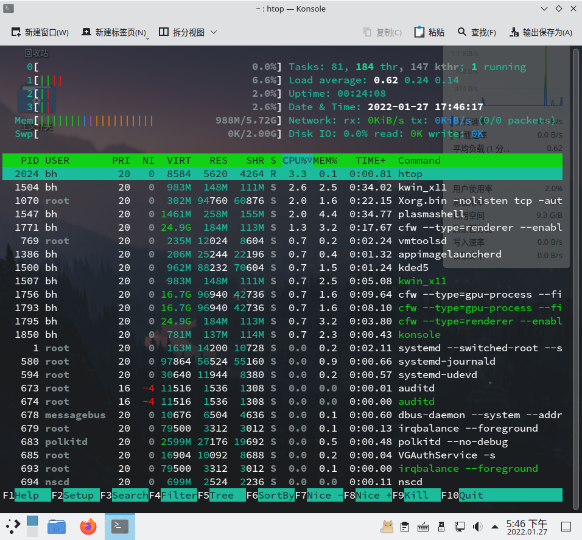

# 管理运行进程

## 理解进程

Linux 是一个多用户系统，支持许多程序同时运行。

进程（process）是命令的运行实例。例如，系统上可能有一个 `nano` 命令。但如果 `nano` 当前由 15 个不同的用户运行，则该命令由 15 个不同的运行进程表示。

每一个的进程都会有一个独一无二的 PID（进程标识符，process ID），Linux 使用 PID 识别进程，并将同一程序的不同进程进行区分。当进程结束后，PID 就会被系统回收，分配给新的进程。

除了 PID，一个进程还会具有其他的属性，如，进程所属的用户和用户组，这将决定系统如何为一个进程分配系统资源。管理进程是 Linux 系统管理员的重要技能之一。

## 列举进程

### 使用 ps 列出进程

在命令行界面中，最常用于列出运行进程的命令行工具是 `ps`。使用该命令即可查看正在运行的进程。

```
bh@localhost:~> ps u
USER        PID %CPU %MEM    VSZ   RSS TTY      STAT START   TIME COMMAND
bh         2400  0.0  0.1   9968  6372 pts/1    Ss   15:55   0:00 /bin/bash
bh         2447  100  0.0  10520  3676 pts/1    R+   15:55   0:00 ps u
```

如上，`u` 或 `-u` 选项用于显示用户名和其他信息，如进程开始的时间、与归属于当前用户的进程的 CPU 和内存使用情况。上述显示的进程均和当前的终端（`tty1`）关联在一起。在图形化界面未发明之前，人们都是通过字符终端控制系统，一个终端通常就代表一个用户。如今，通过在桌面上打开多个虚拟终端或终端窗口，你可以在一个屏幕上拥有多个“终端”。如上终端设备 `tty1` 正在用于登录会话。

`USER` 列显示了启动该进程的用户名。`PID` 列显示进程的 PID。你可以通过将 PID 作为参数指定进程管理命令对使用该 PID 的进程发送相关的信号（如，重启、结束或挂起）。`%CPU` 和 `%MEM` 列显示了进程使用的 CPU 资源和 RAM 资源（按百分比计算）。

`VSZ`（虚拟集大小）显示图像进程（image process）的大小（以千字节 kb 为单位），`RSS`（驻留集大小）显示进程占用物理内存的大小。`VSZ` 和 `RSS` 的大小可能不同，因为 `VSZ` 是为进程分配的内存量，而 `RSS` 是实际使用的内存量。`RSS` 内存表示不能交换的物理内存。

`STAT` 列代表了进程的状态，`R` 表示正在运行，`S` 表示该进程已经睡眠。`START` 显示了进程开始运行的时间，`TIME` 显示进程累积使用的系统时间（许多命令消耗的 CPU 时间非常短暂，所以 TIME 为 00:00）。

除了以上的这些进程，Linux 系统还有很多不关联终端的进程。这些在后台运行的进程处理着大量事务（比如发现新设备、启动时唤醒图形界面和管理系统资源）。它们随着系统的启动而运行，随着系统关闭或用户注销（部分后台进程不会因为用户注销而停止）而停止。

要以当前用户的身份查看 Linux 系统上运行的所有进程，键入：

```
$ ps ux | less
```

要查看所有的进程，键入：

```
$ ps aux | less
```

你可以使用 `-o` 选项和 `--sort` 选项对 ps 的输出结果进行修改和排序。如：

```
bh@localhost:~> ps -eo pid,user,uid,group,gid,vsz,rss,comm | less
   PID USER       UID GROUP      GID    VSZ   RSS COMMAND
     1 root         0 root         0 167048 14080 systemd
     2 root         0 root         0      0     0 kthreadd
     3 root         0 root         0      0     0 rcu_gp
     4 root         0 root         0      0     0 rcu_par_gp
     6 root         0 root         0      0     0 kworker/0:0H-events_highpri
... ...
bh@localhost:~> ps -eo pid,user,group,gid,vsz,rss,comm --sort=-vsz | head
   PID USER     GROUP      GID    VSZ   RSS COMMAND
  1543 bh       bh        1000 268746444 32796 baloo_file
  1773 bh       bh        1000 25530864 191624 cfw
  1577 bh       bh        1000 21425924 152472 cfw
... ...
```

如上，`-e` 选项能列出全部的进程，`--sort=-vsz` 选项将输出按 `VSZ` 进行降序排列。

是不是看着很繁琐，且你无法查看实时运行情况？

### 使用 top 列出和更改进程

`top` 也是一个常用的命令，用于实时查看进程和系统概况：


`top` 命令默认根据进程消耗的 CPU 资源（`%CPU`）进行排序。在发现异常进程后，你可以使用 `top` 终止进程（`kill`）或者重新设定进程优先级（`renice`）。

如果你希望能够终止或取消任何进程，则需要以 root 用户身份运行 top。如果你只想显示进程并可能终止或更改你自己的进程，你可以普通用户的身份执行此操作。

有关系统的概况显示在 `top` 输出的顶部，然后是有关每个正在运行的进程的信息（或至少与屏幕上显示的一样多）。你可以使用 `top` 查看系统运行了多长时间，当前有多少用户登录到系统，以及过去 1、5 和 10 分钟的系统平均负载。其他概况信息包括当前正在运行的进程（任务）数量、正在使用的 CPU 数量以及可用和正在使用的 RAM 和 SWAP 空间。

概况信息的下方是进程列表，该列表按每个进程使用的 CPU 百分比排序。默认情况下，所有这些信息每 5 秒重新刷新一次。按 h 键查看帮助选项，然后按 q 或 Esc 键返回 `top` 输出界面。

按下 k 键，然后输入进程的 PID 即可杀死（强制终止）该进程。

### 使用 Htop 列出进程

`htop` 是一个类似 `top` 的进程管理器，支持使用鼠标控制进程。



- 在 openSUSE 上安装 `htop`：`$ sudo zypper in htop`
- 在 Fedora 上安装 `htop`：`$ sudo dnf in htop`

要启动 htop，只需要输入命令：`htop` 即可。

你可以使用鼠标点击选中某个进程，然后再点击底栏的按钮（如 `Nice -`、`Nice +` 或 `Kill`）对进程进行管理。要退出 `htop`，点击底栏最右侧的 `Quit` 或按 q 键退出。

### 使用系统监视器列出进程

每个桌面环境都有一个图形化系统监视器用于管理进程。 KDE 桌面默认使用 `plasma-systemmonitor`，xfce4 桌面默认使用 `xfce4-taskmanager`，gnome 桌面环境默认使用 `gnome-system-monitor`。

以 `plasma-systemmonitor` 为例，打开该应用程序，在左侧点击**进程**，进入进程页面。你可以点击顶栏，将进程按照某一要求（如进程名，内存使用量）进行升序或降序排序。然后鼠标右键点击你要控制的进程，然后**发送信号**（如待机、挂起或强制终止等）至进程。

## 管理后台和前台进程

在图形化界面中，你可以同时运行多个程序，然后在它们之间不断切换。在命令行界面中，你所看到的似乎就是你所运行的全部程序。

虽然 shell 不能让你同时运行多个程序，但允许你把活跃的进程移动至后台或前台。这样你就能同时运行多个程序，并处理其中的一个活动进程。

### 运行后台进程

要将进程放至到后台，你可以在命令运行的时候，按下快捷键 `Ctrl + Z` 或在输入的命令末尾加上 `&`，如：

```
bh@localhost:~> find ~ > ~/filelist &
[3] 8855
```

如上，该命令会将你用户目录（`$HOME`）下的所有文件都打印出来，然后导入到 同一目录的 `filelist` 纯文本文件中，该命令是在后台运行。在将进程放至后台时，你可以同时看到和该进程相关的 job 值（`[3]`）和进程 ID（`8855`）。要查看当前后台运行的进程，请输入 `jobs`：

```
bh@localhost:~> jobs
[1]-  已停止               sudo zypper ref
[2]+  已停止               htop
[3]   已完成               find ~ > ~/filelist
```

如上，第一个进程（Job 1）是一个刷新元数据的进程，第二个进程是 `htop`，第三个进程则是刚刚放至后台的 `find`。

紧随 job 数字后加号 (+) 表示它最近被放置在后台中，减号 (-) 表明它在最近的后台进程被放置到后台之前就已经被放置在后台。前两个任务因为都需要终端的输入，所以它们无法在后台运行，只能进入`已停止`的状态，直到用户将它们切换到前台。第三个命令由于不需要终端的输入，所以它在完成任务后，会自动退出（并显示`已完成`）。

### 将命令切换到前台

你可以使用 `fg` 命令将特定的进程切换到前台，如上文的中例子，要将第二个进程切换到前台，你可以输入：`$ fg 2`。

## 强制终止和调整优先级

### 使用 kill 和 killall 终止进程

你可以使用 `kill` 或 `killall` 向特定的进程发送一个终止信号（signal）。

在使用 `ps` 或 `top` 之类的命令确定你要终止的进程后，你可以使用 `kill` 和该进程的 PID 来结束此进程。例如：

```
[bh@c004-v1 ~]$ ps
    PID TTY          TIME CMD
   2225 pts/0    00:00:00 bash
   2257 pts/0    00:00:00 htop
   2299 pts/0    00:00:00 ps
[bh@c004-v1 ~]$ kill 2257
```

除了用于告诉进程中止的信号外，还有其他可用于告诉进程重新读取配置文件、暂停或挂起后继续的信号。信号用数字和名称表示，最为常见的信号包括 `SIGKILL (9)`、`SIGTERM (15)` 和 `SIGHUP (1)`。默认的信号是用于完全中止进程的 `SIGTERM`。`SIGKILL` 可用于完全中止进程；`SIGHUP` 可用于让进程重新读取配置文件；`SIGSTOP` 可用于暂停进程；`SIGCONT` 可用于继续运行已暂停的进程。

不同的进程对于信号的反应是不一样，但进程都无法屏蔽 `SIGKILL` 和 `SIGSTOP` 信号。一些信号的样例如下所示（键入 `$ man 7 signal` 获取更多信息）：

|信号|数字|描述|
|---|---|---|
|SIGHUP|1|检测到控制终端挂起或控制进程中止。|
|SIGINT|2|从键盘中断。|
|SIGQUIT|3|退出键盘。|
|SIGABRT|6|来自 abort(3) 的中止信号。|
|SIGKILL|9|中止信号。|
|SIGTERM|15|终止信号。|
|SIGCONT|19,18,25|如果暂停则继续|
|SIGSTOP|17,19,23|暂停进程|

注意，由于架构的差异，`SIGCONT` 和 `SIGSTOP` 具有不同的值，第一个值适用于 Alpha 和 SPARC 架构，第二个值适用于 x86 和 Power 架构，第三个值适用于 MIPS 架构。

```
$ kill 2257
$ kill -15 2257
$ kill -SIGKILL 2257
```

紧接上文的例子，`kill` 命令默认发送的信号是 `SIGTERM (15)`。你可以使用 `-` 和数字或者信号名称改变 `kill` 命令发送的信号。另一个有用的信号是 `SIGHUP (1)`，你可以使用此命令在某程序崩溃时，让该程序重新读取配置文件并重启，如重启 gnome-shell：

```
# kill -1 1833 #此处假定 gnome-shell 的 PID 是 1833。
# killall -HUP gnome-shell
```

`killall` 命令和 `kill` 类似。不同之处在于，`killall` 允许你使用进程名字作为命令参数，向匹配关键字的进程发送信号。缺点是，这会杀死所有同名的进程，并误伤正常运行的进程。

### 使用 nice 和 renice 设置进程优先级

Linux Kernel 的一项工作是将计算机资源（CPU、RAM）分配给各个进程，而各个进程所能获得资源由 `nice` 值决定。每一个进程都有 nice 值，其取值范围是 -20 至 19，默认值是 0。

- nice 值越小，进程能获得 CPU 资源就越多。
- 普通用户只能将 nice 设置为 0~19 之间的数值，不能设置为负值。
- 普通用户只能将 nice 值设置为更高的值，负值和比原始值更低的 nice 值是不允许的操作。
- 普通用户只能调整属于他自己的进程的 nice 值。
- root 用户或系统管理员（`wheel` 用户组成员）不受以上限制。

你可以使用 `nice` 为一个进程设定 nice 值，然后使用 `renice` 重新设置该进程的 nice 值。注意，如上所述，你可能需要管理员权限才能运行这两个命令。

```
# nice -n +5 updatedb &
# renice -n -5 20284
```

如上，要将 `updatedb` 的 nice 值设置为 5，你需要使用 `-n` 选项，将 `+5` 作为参数。要将 `updatedb` 的 nice 值调整为 -5，你需要使用 `-n` 选项，将 `-5` 作为参数。然后你就在 `top` 命令中看到 `updatedb` 进程（因为它具有很高的优先级）。

- `updatedb` 命令用于收集文件系统的文件名生成供 `locate` 命令使用的数据库文件。

## 使用 cgroup 限制进程

`nice` 命令只能设置单一进程的优先级，而 Linux 系统或应用程序要正常运作是由大量进程所组成的。所以此时你需要使用 `cgroup` 命令。

Cgroups 可用于将进程标识为属于特定的控制组的任务。可以在层次结构中设置任务，例如，可能有一个称为守护进程的任务，它为所有守护进程服务器进程设置默认限制，然后是子任务，可以为 FTP 服务守护进程设置 Web 服务器守护进程 (httpd) 的特定限制 ( vsftpd)

当一个任务启动一个进程时，初始进程启动的其他进程（称为子进程）继承为父进程设置的限制。这些限制可能表明控制组中的所有进程只能访问特定的处理器和某些 RAM 集。 或者他们可能只允许访问最多 30% 的机器总处理能力。