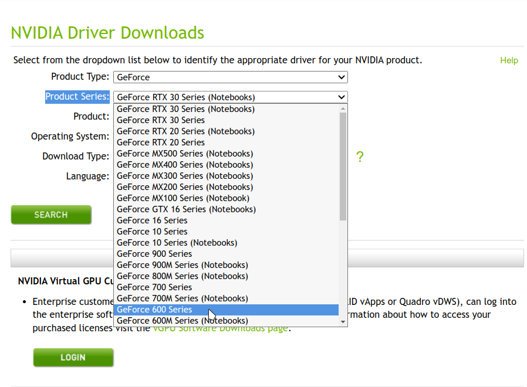

# 独显驱动

!!! Warning
    如果你需要一个稳定良好的游戏体验（针对各种类型的游戏），请使用 Windows 10。

AMD 的显卡驱动是开源且已经并入内核主线，无需再次手动安装。

在安装显卡驱动前，你必须先将系统更新至最新版本。

## openSUSE

!!! warning
    一般地，你需要参考[前文](./setup-proxy.md)配置好代理才能正常从 NVIDIA 源下载适配于 openSUSE 的显卡驱动。  
    并不建议直接从 NVIDIA 官网下载驱动文件，手动安装驱动。

在 openSUSE 上安装显卡驱动：

```
sudo zypper addrepo --refresh https://download.nvidia.com/opensuse/tumbleweed NVIDIA
```

运行下列命令，来确定您的显卡型号：

```
sudo lspci | grep VGA
sudo lscpu | grep Arch
```

或

```
sudo hwinfo --gfxcard | grep Model
sudo hwinfo --arch
```

NVIDIA 为 openSUSE 用户提供了三种显卡驱动：

```
bh@c004-h0:~> zypper se x11-video-*
正在加载软件源数据...
正在读取已安装的软件包...

S | Name                | Summary                                                 | Type
--+---------------------+---------------------------------------------------------+-------
  | x11-video-nvidiaG04 | NVIDIA graphics driver for GeForce 400 series and newer | 软件包
  | x11-video-nvidiaG05 | NVIDIA graphics driver for GeForce 600 series and newer | 软件包
  | x11-video-nvidiaG06 | NVIDIA graphics driver for GeForce 700 series and newer | 软件包
```

你需要在 [NVIDIA 的官网](https://www.nvidia.com/Download/index.aspx?lang=en-us)查阅支持你的硬件的驱动型号。在 Product Type 中，将类型选择为 GeForce，然后点击 Product Series 选择框，即可看到所有的 GeForce 显卡系列：



使用新款 NVIDIA 显卡的用户（Geforce 版本号>600，比如 MX450, 630，1080，2060，3090）[支持的型号列表](https://www.nvidia.cn/Download/driverResults.aspx/165210/cn)，可以执行下列命令：

```
sudo zypper in x11-video-nvidiaG06
```

使用老旧 NVIDIA 显卡的用户（ Geforce 版本号<600）[支持的型号列表](https://www.nvidia.cn/Download/driverResults.aspx/160312/cn)

```
sudo zypper in x11-video-nvidiaG04 #或者其他型号的驱动也可。
```

最后，重启电脑，以使用新的显卡驱动。期间，你可能需要[手动导入 MOK 密钥](https://zh.opensuse.org/SDB:NVIDIA_%E9%A9%B1%E5%8A%A8#.E5.AE.89.E5.85.A8.E5.90.AF.E5.8A.A8)。

如果要利用 OpenGL 加速，你必须安装一个附加包，选择与驱动程序对应的包：

```
$ zypper se nvidia-glG0*
```

#### 故障排除

相关信息详见：

- [SDB:NVIDIA 驱动](https://zh.opensuse.org/SDB:NVIDIA_%E9%A9%B1%E5%8A%A8)
- [SDB:NVIDIA SUSE Prime](https://zh.opensuse.org/SDB:NVIDIA_SUSE_Prime)

## Fedora

首先你需要[添加 RPMFusion 软件源](./index.md)。

然后检查是否更新至最新状态：

```
sudo dnf update -y #更新后重启
```

然后安装驱动（针对从 2014 年开始至今发售的 GeForce/Quadro/Tesla 显卡）：

```
sudo dnf install akmod-nvidia
```

!!! warining
    请记住在 RPM 事务结束后继续等待，直到完成构建 kmod。在某些系统上，这可能需要长达 5 分钟。

!!! note
    构建模块后，`modinfo -F version nvidia` 应输出驱动程序的版本，例如 440.64 而不是 modinfo：`ERROR: Module nvidia not found`.

安装 CUDA 驱动（可选）：

```
sudo dnf install xorg-x11-drv-nvidia-cuda
```

### 对于老设备

!!! warining
    请记住在 RPM 事务结束后继续等待，直到完成构建 kmod。在某些系统上，这可能需要长达 5 分钟。

针对在 2012 至 2014 期间发售的 NVIDIA Kepler GPU:

```
sudo dnf install xorg-x11-drv-nvidia-470xx akmod-nvidia-470xx
```

CUDA 驱动（可选）：

```
sudo dnf install xorg-x11-drv-nvidia-470xx-cuda
```

针对 2010 年至 2012 年期间发售的 NVIDIA Fermi GPU：

```
sudo dnf install xorg-x11-drv-nvidia-390xx akmod-nvidia-390xx
```

CUDA 驱动（可选）：

```
sudo dnf install xorg-x11-drv-nvidia-390xx-cuda 
```
