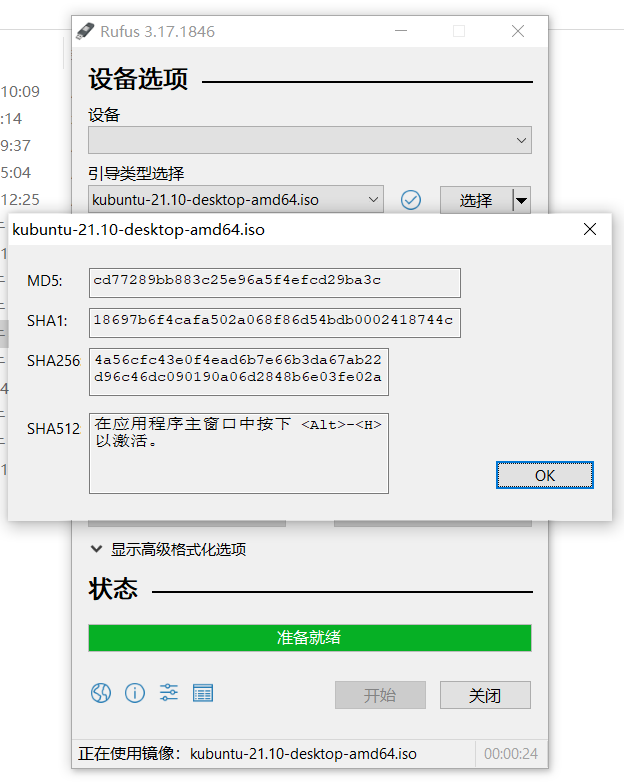

# 安装前准备

本文主要描述安装 Linux 前应当做的一些预备工作。

## 最低硬件需求

对于本项目所涉及的 Linux 发行版的最低硬件要求如下所示：

openSUSE Tumbleweed & openSUSE Leap：

- 1.6 GHz 或更高的处理器（推荐奔腾 4 2.4 GHz或更高的处理器或任何 AMD64 或 Intel64 处理器）；
- 1GB 物理内存（推荐 4GB 或以上）；
- 10GB 的可用磁盘空间用于最小的安装，16GB 的可用磁盘空间用于图形化桌面（日常使用建议 40GB 或更多）；
- 支持大多数现代声卡和显卡，800x600 的显示分辨率（推荐 1024 x 768 或更高）。

Fedora Workstation：

- 2GHz 双核处理器或更快的处理器（推荐使用 2GHz 四核或更快的处理器）；
- 2GB 物理内存（推荐 4GB 或以上）；
- 15GB 磁盘空间（推荐 20 GB 或以上）；
- 支持大多数现代声卡和显卡，分辨率为 1024x768 的 VGA 显示器。

Kubuntu：

- 2GHz 双核处理器；
- 4GB 物理内存；
- 8GB 磁盘空间（推荐 25GB 或以上）；
- 1024x768 分辨率的 VGA 显示器，显存为 256MB 或更高的显卡
- 可用的网络连接

## 选择桌面环境

Linux 可用的桌面环境非常多，流行的桌面环境主要有 KDE，Gnome 和 Xfce。有关这三个桌面的介绍详见[此处](./../desktop/desktop-environment.md)。
## 下载可启动镜像

为了简化流程，我们推荐使用从镜像站下载的 DVD 或 LiveDVD 离线镜像安装系统（2020 年后生产的桌面设备最常见的系统架构为 `x86_64`）。

!!! attention
    用于离线安装的 ISO 镜像体积较为庞大，我们推荐你采用 [aria2](https://aria2.github.io/)、[FDM](https://www.freedownloadmanager.org/zh/) 和 [Motrix](https://motrix.app/) 之类的下载管理器下载 ISO 镜像文件以避免常规浏览器下载出现网络中断的情况。

本指南快速入门安装教程涵盖的发行版的镜像下载链接如下：

=== "openSUSE"

    * 安装镜像：[openSUSE Tumbleweed (x86_64, DVD)](https://opentuna.cn/opensuse/tumbleweed/iso/openSUSE-Tumbleweed-DVD-x86_64-Current.iso) [约 4.7GB]

=== "Fedora"

    * 安装镜像：[Fedora 35 (x86_64, Workstation)](https://opentuna.cn/fedora/releases/35/Workstation/x86_64/iso/Fedora-Workstation-Live-x86_64-35-1.2.iso) [约 2GB]

=== "Kubuntu"

    * 安装镜像：[Kubuntu 21.10 (x86_64, DVD)](https://opentuna.cn/ubuntu-cdimage/kubuntu/releases/21.10/release/kubuntu-21.10-desktop-amd64.iso) [约 3GB]

=== "其他发行版"

    以 OpenTUNA 源为例，下载的方法如下：

    1. 打开 [OpenTUNA](https://opentuna.cn/) 页面。点击页面右侧的”获取下载链接“。
    2. 选择你要下载的镜像文件。
    3. 点击对应链接直接下载或者右键另存为。也可以右键复制链接用迅雷之类的下载器下载。

!!! attention
    许多 Linux 发行版会有多种不同的镜像。这些镜像会针对不同的 CPU 或者带有不同的软件，同时也有一种专门用于试用的 Live 镜像。请按照自己的需求下载。

## 创建可启动镜像

首先，你需要一个储存空间大小在 8GB 或以上的 U 盘。然后你可以使用 [Rufus](https://rufus.ie/zh/)、[balenaEtcher](https://www.balena.io/etcher/) 或 [Fedora Media Writer](https://getfedora.org/en/workstation/download/) 等工具将 ISO 文件刻录到 U 盘中，制成一个可引导启动的 Linux 系统安装介质。

- Rufus  
  将你的 U 盘插入电脑，打开 Rufus，它会自动选择可用的移动存储设备。点击“**选择**”打开要刻录的镜像文件。请确认选择正确的设备，然后点击底端的“**开始**”等待刻录自动完成。
- balenaEtcher  
  将你的 U 盘插入电脑，打开 balenaEtcher，点击最左侧的加号下面的“Flash from file”，选择要写入的ISO镜像。点击中间的磁盘图标下面的“Select target”，选择要写入的设备。点击最右边的“Flash!”按钮，开始写入。等待刻录自动完成。
- Fedora Media Writer  
  插入 U 盘，运行 Fedora Media Writer 选择“自定义镜像”，并选择刚刚下载的 ISO 镜像。请确保选择正确的设备，然后点击 “写入磁盘”，等待刻录完成后即可。

如果你想提高 U 盘的利用率或想一个 U 盘容纳多个操作系统的安装文件，你可以访问 [ventoy](https://www.ventoy.net/cn/index.html) 了解更多信息。

## 划分未分配的磁盘空间

!!! attention
    如果你选择将 Tumbleweed 作为日常使用的系统，它的根目录起码需要 40GB 的空间（因为 openSUSE 默认启用了快照功能）。

如果要在实体机上安装 Linux，请提前用磁盘分区工具划分一个大小为 20GB 或更大的未分配的磁盘空间（不要格式化和写入文件系统）。

## 引导启动

你需要查询一下你当前的设备如何在开机时手动重定向至 BIOS 界面，然后选择引导设备。

## 校验和

虽然 ISO 文件损坏的情况很少发生，但是我们依然建议你计算 ISO 文件的校验和并与官方的校验和进行比对。

Rufus 也可以用于校验文件（校验按钮位于选择镜像文件的按钮左侧）：

