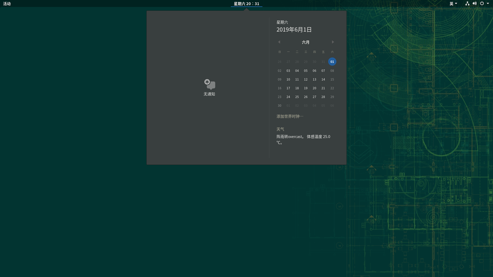
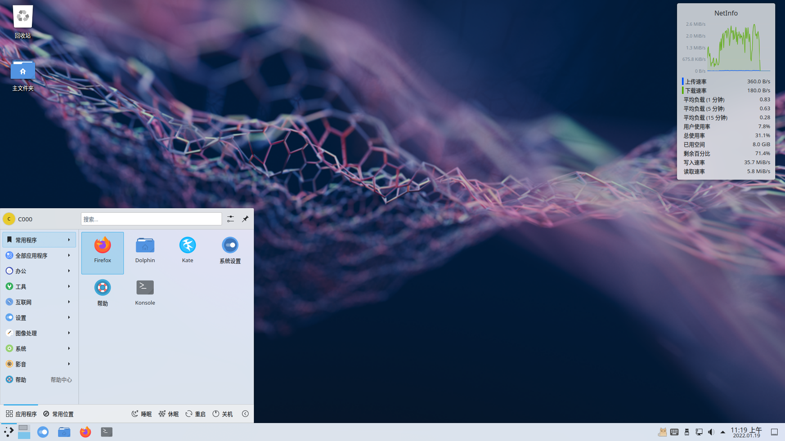
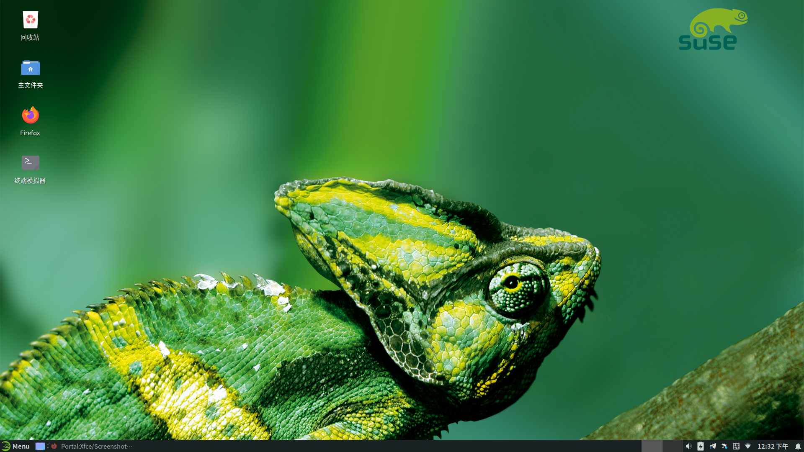

## 什么是桌面环境

Desktop Environment（桌面环境）也被称之为 Linux 桌面。

在计算机科学中，桌面环境 (DE) 是桌面比拟（desktop metaphor）的一种实现，由运行在计算机操作系统之上的一组程序组成，这些程序共享一个通用的图形用户界面 (GUI)，有时被描述为图形 shell。在移动计算兴起之前，桌面环境主要出现在个人电脑上。桌面 GUI 帮助用户轻松访问和编辑文件，但它们通常不提供对底层操作系统中所有功能的访问。相反，当需要完全控制操作系统时，仍然使用传统的命令行界面 (CLI)。

桌面环境通常由图标、窗口、工具栏、文件夹、壁纸和桌面小部件组成。GUI 还可能提供拖放功能和其他使桌面比拟更加完整的特性。桌面环境旨在成为用户与计算机交互的直观方式，使用的概念类似于与物理世界交互时使用的概念，例如按钮和窗口。

虽然术语桌面环境最初描述了一种遵循桌面比拟的用户界面风格，但它也开始描述实现桌面比拟本身的程序。这种用法已被 Common Desktop Environment、K Desktop Environment 和 GNOME 等项目推广。

## 主要的桌面环境

Linux 可用的桌面环境非常多，各有特色，面向不同的群体。

其中由三个最为流行和广泛应用的桌面环境：[Gnome](https://www.gnome.org/)、[KDE](https://kde.org/) 和 [Xfce](https://xfce.org/)。

**注意，你所看到的桌面截图并非用户最终使用的样子**，Liunx 桌面的开放使得用户可以根据自己的喜好进行修整。你可能会看到 MacOS 风格的 KDE 或是 Windows 风格的 Gnome。

Gnome 是由 [Gnome Project](https://www.gnome.org/) 主导开发的一个类似于 Mac 的桌面环境，是 Fedora, RHEL 等 Linux 社区/商业发行版的默认桌面环境。Gnome 为了让用户专注于工作本身而生，所以它的整体设计是简约风格。Gnome 强调工作空间的管理与使用，而不是让一堆的程序界面杂乱无章地散落在一个桌面上。Gnome 的缺点是缺乏灵活的自定义，对插件的管理能力比较差，很多额外的功能实现需要依靠第三方工具。

KDE 是由 [KDE.org](https://kde.org/) 主导开发的一个类似 Windows 的桌面环境。它具有类似 Windows 但更胜一筹，非常优美的初始外观；并支持用户高度自定义整个系统（KDE 甚至支持美化登陆界面的外观）；和 KDE 环境深度整合的 [KDE 套件](https://apps.kde.org/)也是让很多用户喜爱 KDE 的原因之一; KDE 还具有很好的可扩展性，用户可以安装各种各样的插件增强 KDE 的功能。KDE 的缺点是容易因为过度自定义变得臃肿，内存占用偏高，其配置页面可能会使一些用户晕头转向，个别 KDE 软件功能和效率不及专业软件。

Xfce 是由 [Xfce Project](https://xfce.org/) 主导开发的一个类似 Windows 的轻量级桌面环境。Xfce 占用的资源更少，整体更轻便（依赖少量的额外软件包），反应更灵敏（操作灵敏度可以和同硬件配置的 Windows 相提并论）；以三年为一个研发周期，注重稳定性；虽然简约，但已具备必须的基本功能。Xfce 的缺点是它的默认配置对于新用户来说显得有些古板或简陋，不支持动画。

### 截图欣赏

由 openSUSE wiki 提供的三个桌面环境的截图：

- [Gnome](https://zh.opensuse.org/Portal:GNOME/Screenshots)
- [KDE](https://zh.opensuse.org/KDE)
- [Xfce](https://zh.opensuse.org/Portal:Xfce/Screenshots)